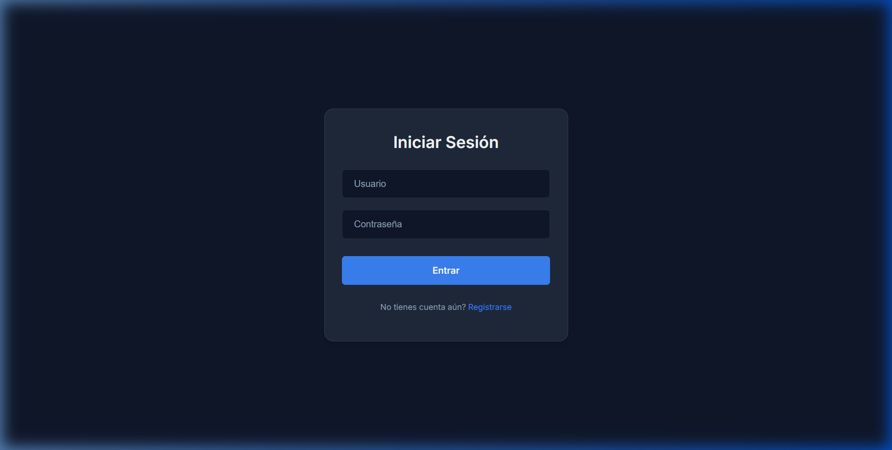
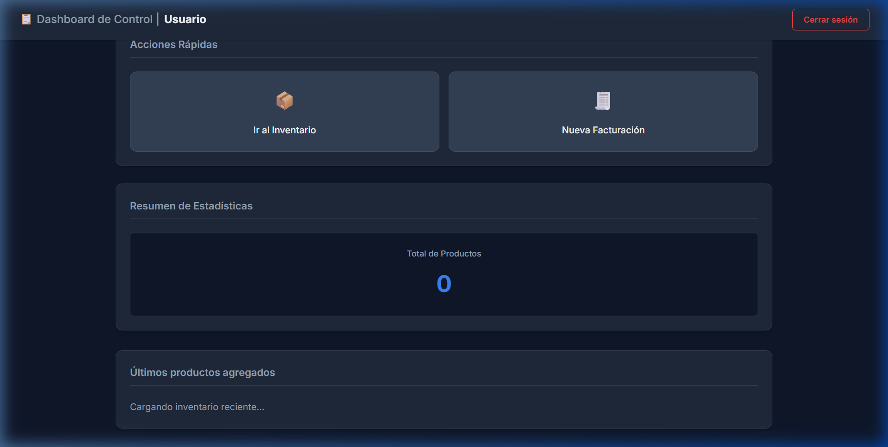
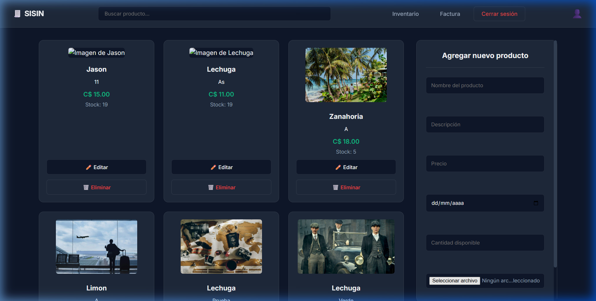
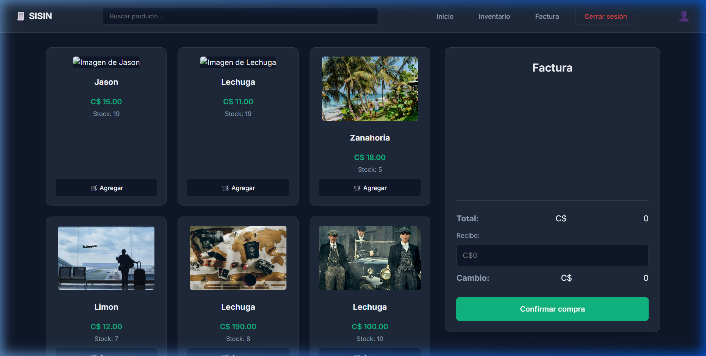

<h1 align="center">📋 SISIN — Sistema de Inventario</h1>

<p align="center">
  Sistema Web Full Stack para la gestión de inventario, productos y facturación. Permite registrar productos, controlar el stock y generar facturas de compra de manera sencilla.
</p>

<p align="center">
  
  
  
  
  
  
</p>

---

## 📸 Capturas de Pantalla

| Login | Dashboard |
|:---:|:---:|
|  |  |

| Inventario | Facturación |
|:---:|:---:|
|  |  |

---

## ✨ Funcionalidades

- 🔐 **Autenticación segura** — Registro e inicio de sesión con contraseñas encriptadas con `bcrypt`.
- 📦 **Gestión de Inventario** — Agrega, edita y elimina productos con imagen, precio, cantidad y fecha de vencimiento.
- 🧾 **Facturación** — Selecciona productos, controla cantidades, calcula el total, el cambio y descuenta el stock al confirmar la compra.
- 🏠 **Dashboard** — Vista resumen con accesos rápidos y últimos productos registrados.
- 🔒 **Sesiones protegidas** — Las rutas del sistema están protegidas y redirigen al login si no hay sesión activa.

---

## 🛠️ Tecnologías Utilizadas

### Backend
| Tecnología | Uso |
|---|---|
| Node.js | Entorno de ejecución del servidor |
| Express.js | Framework para las rutas y middlewares |
| MongoDB + Mongoose | Base de datos y modelado de documentos |
| bcrypt | Encriptación de contraseñas |
| express-session | Gestión de sesiones de usuario |
| Multer | Carga de imágenes de productos |
| dotenv | Manejo de variables de entorno |

### Frontend
| Tecnología | Uso |
|---|---|
| HTML5 / CSS3 | Estructura y estilos de todas las vistas |
| JavaScript (Vanilla) | Lógica de cliente, fetch API y DOM |
| Google Fonts (Inter) | Tipografía moderna |
| CSS Variables | Paleta de colores unificada (Dark Dashboard) |

---

## 🚀 Cómo Ejecutarlo Localmente

### Pre-requisitos
- [Node.js](https://nodejs.org/) instalado
- [MongoDB](https://www.mongodb.com/) corriendo localmente o una cuenta en [MongoDB Atlas](https://www.mongodb.com/cloud/atlas)

### Pasos

1. **Clona el repositorio:**
   ```bash
   git clone https://github.com/JsonStev/Sistema-de-Inventario.git
   cd Sistema-de-Inventario
   ```

2. **Instala las dependencias:**
   ```bash
   npm install
   ```

3. **Configura las variables de entorno:**

   Crea un archivo `.env` en la raíz del proyecto con el siguiente contenido:
   ```env
   PORT=3000
   MONGO_URI=mongodb://localhost:27017/SISIN
   SECRET=tu_clave_secreta_aqui
   ```

4. **Inicia el servidor:**
   ```bash
   node app.js
   ```

5. **Abre el navegador en:**
   ```
   http://localhost:3000
   ```

---

## 📁 Estructura del Proyecto

```
Sistema-de-Inventario/
├── app.js                  # Servidor principal (Express)
├── .env                    # Variables de entorno (no incluido en Git)
├── models/
│   ├── Usuario.js          # Modelo de usuario (Mongoose)
│   └── Producto.js         # Modelo de producto (Mongoose)
├── middlewares/
│   └── verificarSesion.js  # Protección de rutas privadas
└── public/                 # Frontend (archivos estáticos)
    ├── index.html          # Página de inicio de sesión
    ├── registro.html       # Página de registro
    ├── home.html           # Dashboard principal
    ├── inventario.html     # Gestión de inventario
    ├── factura.html        # Sistema de facturación
    ├── css/
    │   ├── variables.css   # Paleta de colores global (Dark Dashboard)
    │   ├── styles.css      # Estilos de Login y Registro
    │   ├── home.css        # Estilos del Dashboard
    │   └── estilos.css     # Estilos de Inventario y Factura
    ├── js/
    │   ├── home.js         # Lógica del Dashboard
    │   ├── inventario.js   # Lógica del Inventario
    │   ├── factura.js      # Lógica de Facturación
    │   ├── login.js        # Lógica del Login
    │   └── registro.js     # Lógica del Registro
    └── uploads/            # Imágenes subidas por el usuario
```

---

## 👤 Autor

**Jason Stev** — [@JsonStev](https://github.com/JsonStev)
